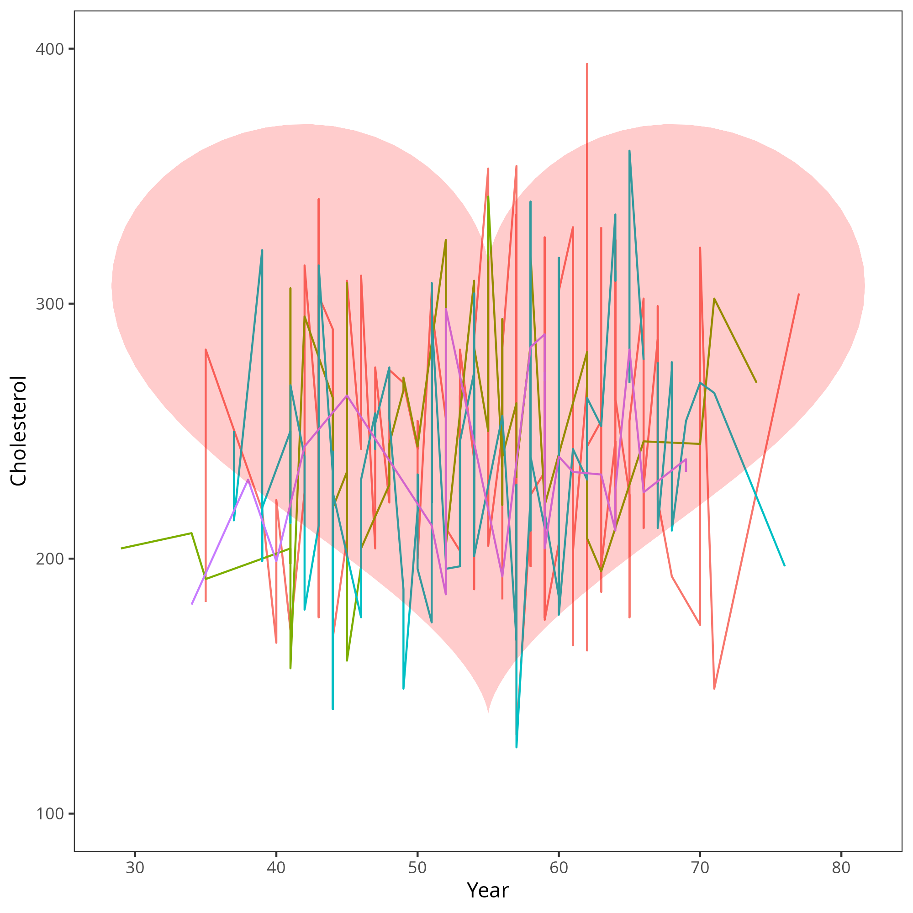

```{r}
#| include: false

library(tidyverse)
library(rcistats)
library(broom)
library(patchwork)


theme_set(theme_bw() +
  theme(
    axis.text.x = element_text(size = 20),
    axis.text.y = element_text(size = 20),
    axis.title = element_text(size = 30),
    plot.title = element_text(size = 48),
    strip.text = element_text(size = 20),
    legend.title = element_blank(),
    legend.text = element_text(size = 24)
  ))

heart_disease <- kmed::heart
heart_disease$disease <- factor(ifelse(heart_disease$class == 0, "no", "yes")) 
heart_disease$sex <- ifelse(heart_disease$sex == T, "Male", "Female") |> factor()
heart_disease$cp <- ifelse(heart_disease$cp == 1, "Typical Angina",
                           ifelse(heart_disease$cp == 2, "Atypical Angina", 
                                  ifelse(heart_disease$cp == 3, "Non-anginal Pain", "Asymptomatic"))) |> 
                    factor(levels = c("Asymptomatic", "Non-anginal Pain", "Atypical Angina", "Typical Angina"))
heart_disease$fbs <- ifelse(heart_disease$fbs == T, "Fasting Blood Sugar >120" , "Fasting Blood Sugar <= 120") |> factor()
heart_disease$restecg <- ifelse(heart_disease$restecg == 0, "Normal",
                                ifelse(heart_disease$restecg == 1, "ST-T wave Abnormality", "Left Ventricular Hypertrophy")) |> 
                          factor(levels = c("Normal", "ST-T wave Abnormality", "Left Ventricular Hypertrophy"))
heart_disease$slope <- ifelse(heart_disease$slope == 1, "Positive Slope",
                              ifelse(heart_disease$slope == 2, "Zero Slope", "Negative Slope")) |> 
                              factor(levels = c("Zero Slope", "Positive Slope", "Negative Slope"))
heart_disease$thal <- ifelse(heart_disease$thal==3, "Normal",
                             ifelse(heart_disease$thal == 6, "Fixed Defect", "Reversible Defect")) |> 
                              factor(levels = c("Normal", "Fixed Defect", "Reversible Defect"))

```

## R Packages

- Tidyverse
- rcistats
- broom

# Data & Motivation

## Palmer Penguins Data

::: {.columns}
::: {.column}

### Variables of Interest

- `fliper_len`: Flipper Length
- `body_mass`: Body mass in [grams](https://en.wikipedia.org/wiki/Gram)

:::
::: {.column}
{fig-alt="An image of several penguins in Antartica."}

:::
::: 

## Heart Disease Data

::: {.columns}
::: {.column}

### Variables of Interest

- `trestbps`: Resting Blood Pressure
- `disease`: Indicating if they have heart disease

:::
::: {.column}
{fig-alt="An image of a graph and a heart."}
:::
:::

## No Association

```{r}
#| echo: false
#| fig-alt: |
#|  A scatter plot of data points where that do not show 
#|  a positive nor negative trend. A flat line is going 
#|  from left to right through the data points. 

x <- rnorm(1000)
y <- rnorm(1000)

ggplot(tibble(x, y), aes(x, y)) +
  geom_point() +
  stat_smooth(method = "lm", se = F)

```

## An Association

```{r}
#| echo: false
#| fig-alt: |
#|  A 2 side-by-side scatter plots of data points 
#|  that demonstrate a positive or negative trend,
#|  respectively. Each plot contains a line demonstrating 
#|  the relationship of the data. 

x <- rnorm(1000)
y1 <- 3 + 4 * x + rnorm(1000)
y2 <- 8 - 2 * x + rnorm(1000)

g1 <- ggplot(tibble(x = x, y = y1), aes(x, y)) +
  geom_point() +
  stat_smooth(method = "lm", se = F)

g2 <- ggplot(tibble(x = x, y = y2), aes(x, y)) +
  geom_point() +
  stat_smooth(method = "lm", se = F)

g1 + g2 +
  plot_layout(axes = "collect")

```

## Association?

```{r}
#| echo: false
#| fig-alt: |
#|  A scatter plot of data points where there is a 
#|  positive trend. A flat line is going 
#|  from left to right through the data points. 

x <- rnorm(1000)
y <- -2.8 + 0.4 *x + rnorm(1000)

ggplot(tibble(x, y), aes(x, y)) +
  geom_point() +
  stat_smooth(method = "lm", se = F)

```

## Association?

```{r}
#| echo: false
#| fig-alt: |
#|  A scatter plot of data points where there is a 
#|  slight positive trend. A flat line is going 
#|  from left to right through the data points. 
set.seed(890)
x <- rnorm(1000)
y <- -2.8 + 0.4 *x + rnorm(1000, sd = 5)

ggplot(tibble(x, y), aes(x, y)) +
  geom_point() +
  stat_smooth(method = "lm", se = F)

```

## Association?

```{r}
#| echo: false
#| fig-alt: |
#|  A scatter plot of data points where there is a 
#|  slight positive trend. A flat line is going 
#|  from left to right through the data points. 

set.seed(909)
x <- rnorm(1000)
y <- -2.8 + 0.4 *x + rnorm(1000, sd = 35)

ggplot(tibble(x, y), aes(x, y)) +
  geom_point() +
  stat_smooth(method = "lm", se = F)

```


# Statistical Inference

## What is Statistical Inference?

-   Drawing conclusions about a **population** based on a **sample**
-   Population = entire group
-   Sample = subset


## Two Main Types of Inference

1.  Estimation
2.  Hypothesis Testing

::: notes
We'll be focusing on two fundamental techniques in inference. First, estimating population values (like the mean), and second, testing claims about the population.
:::

## Estimation

- **Point Estimate**: Single best guess (e.g., $\hat \beta_1$)
- **Interval Estimate**: Range of values likely to contain the true value

::: notes
Point estimates are easy but not very informative. Intervals give us a sense of uncertainty, which is critical in inference.
:::


## Key Concepts and Tools

To conduct a hypothesis test, we need to know the following:

- Sampling Distribution
- Central Limit Theorem
- Standard Error

::: notes
These three concepts are foundational. Understanding them helps us assess how reliable our estimates are.
:::


# Hypothesis Testing

## Hypothesis Tests

Hypothesis tests are used to test whether claims are valid or not. This is conducted by collecting data, setting the **Null** and **Alternative** Hypothesis.

## Null Hypothesis $H_0$

The null hypothesis is the claim that is initially believed to be true. For the most part, it is always equal to the hypothesized value.

## Alternative Hypothesis $H_1$

The alternative hypothesis contradicts the null hypothesis.

## Example of Null and Alternative Hypothesis

We want to see if $\beta$ is different from $\beta^*$

| Null Hypothesis        | Alternative Hypothesis |
|------------------------|------------------------|
| $H_0: \beta=\beta^*$   | $H_1: \beta\ne\beta^*$ |
| $H_0: \beta\le\beta^*$ | $H_1: \beta>\beta^*$   |
| $H_0: \beta\ge\beta^*$ | $H_1: \beta<\beta^*$   |

## One-Side vs Two-Side Hypothesis Tests

Notice how there are 3 types of null and alternative hypothesis, The first type of hypothesis ($H_1:\beta\ne\beta^*$) is considered a 2-sided hypothesis because the rejection region is located in 2 regions. The remaining two hypotheses are considered 1-sided because the rejection region is located on one side of the distribution.

| Null Hypothesis        | Alternative Hypothesis | Side    |
|------------------------|------------------------|---------|
| $H_0: \beta=\beta^*$   | $H_1: \beta\ne\beta^*$ | 2-Sided |
| $H_0: \beta\le\beta^*$ | $H_1: \beta>\beta^*$   | 1-Sided |
| $H_0: \beta\ge\beta^*$ | $H_1: \beta<\beta^*$   | 1-Sided |

## Hypothesis Testing Steps

1.  State $H_0$ and $H_1$
2.  Choose $\alpha$
3.  Compute confidence interval/p-value
4.  Make a decision

::: notes
Walk through the steps slowly with an example in mind. Emphasize that $\alpha$ is a threshold, not the actual probability of error.
:::

## Rejection Region

- The rejection region  is the set of all test statistic values that lead to rejecting $H_0$.

- It’s defined by a significance level ($\alpha$) — the probability of rejecting $H_0$, when it’s actually true.


## Rejection Region

```{r}
#| code-fold: true
#| fig-alt: "A normal distribution demonstrating the rejection regions."
#| fig-align: center

alpha <- 0.05

# Critical values for two-tailed test
z_critical <- qnorm(1 - alpha / 2)

# Create data for the normal curve
x <- seq(-4, 4, length = 1000)
y <- dnorm(x)

df <- data.frame(x = x, y = y)

ggplot(df, aes(x = x, y = y)) +
  geom_line(color = "deepskyblue", linewidth = 1) +
  geom_area(data = subset(df, x <= -z_critical), aes(y = y), fill = "firebrick", alpha = 0.5) +
  geom_area(data = subset(df, x >= z_critical), aes(y = y), fill = "firebrick", alpha = 0.5) +
  geom_vline(xintercept = c(-z_critical, z_critical), linetype = "dashed", color = "black") 
```


# Decision Making

## Decision Making

Hypothesis Testing will force you to make a decision: Reject $H_0$ **OR** Fail to Reject $H_0$

::: fragment
Reject $H_0$: The effect seen is not due to random chance, there is a process contributing to the effect.
:::

::: fragment
Fail to Reject $H_0$: The effect seen is due to random chance. Random sampling is the reason why an effect is displayed, not an underlying process.
:::

## Decision Making: P-Value

The p-value approach is one of the most common methods to report significant results. It is easier to interpret the p-value because it provides the probability of observing our test statistics, or something more extreme, given that the null hypothesis is true.

::: fragment
**If** $p < \alpha$, then you reject $H_0$; otherwise, you will fail to reject $H_0$.
:::


## Significance Level $\alpha$

The significance level $\alpha$ is the probability you will reject the null hypothesis given that it was true.

::: fragment
In other words, $\alpha$ is the error rate that a researcher controls.
:::

::: fragment
Typically, we want this error rate to be small ($\alpha = 0.05$).
:::

# Confidence Intervals

## Confidence Intervals

- A confidence interval gives a **range of plausible values** for a population parameter.
- It reflects **uncertainty** in point estimates from sample data.


## Interpretation

> "We are 95% confident that the true mean lies between A and B."

- This does **not** mean there's a 95% chance the mean is in that interval.
- It means: if we repeated the sampling process many times, **95% of the intervals would contain the true value**.

::: notes
This is one of the most common misconceptions. Clarify that the confidence is in the *method*, not any one interval.
:::

## Factors Affecting CI Width

-   Sample size ($n$): larger $n$ → narrower CI\
-   Standard deviation ($s$ or $\sigma$): more variability → wider CI\
-   Confidence level: higher confidence → wider CI

::: notes
Use this to summarize what controls how “precise” our confidence interval is. Give examples of each.
:::

## Decision Making: Confidence Interval Approach

The confidence interval approach can evaluate a hypothesis test where the alternative hypothesis is $\beta\ne\beta^*$. The confidence interval approach will result in a lower and upper bound denoted as: $(LB, UB)$.

::: fragment
**If $\beta^*$ is in $(LB, UB)$, then you fail to reject $H_0$. If $\beta^*$ is not in $(LB,UB)$, then you reject $H_0$.**
:::

# Regression Coefficient Inference

## Testing Association

$$
Y =  \beta_0 + \beta_1 X
$$

In an equation, the coefficient multiplied ($\beta_1$) to the variable $X$ determines if there is an association between $X$ and $Y$.

## Coefficient Inference

::: {.columns}

::: {.column}

### No Association

$$
\beta_1 = 0
$$

:::

::: {.column}

### Association

$$
\beta_1 \ne 0
$$

:::

:::

## Hypothesis Test

::: {.columns}

::: {.column}

### Null Hypothesis

$$
H_0:\ \beta_1 = 0
$$

:::

::: {.column}

### Alternative Hypothesis

$$
H_1:\ \beta_1 \ne 0
$$

:::

:::


## Testing Association

$$
Y =  \beta_0 + \beta_1 X_1 + \beta_2 X_2 + \beta_3 X_3  
$$

In an equation, the coefficient multiplied ($\beta_2$) to the variable $X_2$ determines if there is an association between $X_2$ and $Y$.


## Hypothesis Test

::: {.columns}

::: {.column}

### Null Hypothesis

$$
H_0:\ \beta_2 = 0
$$

:::

::: {.column}

### Alternative Hypothesis

$$
H_1:\ \beta_2 \ne 0
$$

:::

:::

# Linear Regression Inference in R

## Conducting HT of $\beta_j$

```r
XLM <- lm(Y ~ X, data = DATA)
tidy(XLM)
```

-   `XLM`: Object where the model is stored
-   `Y`: Name of the outcome variable in `DATA`
-   `X`: Name of the Predictor Variable(s) in `DATA`
-   `DATA`: Name of the data set


## Example 

Is there a significant relationship between penguin body mass (outcome; `body_mass`) and flipper length (predictor; `flipper_len`)? Use the `penguins` data set to determine a significant association.

## Example

```{r}
#| code-fold: show
#| eval: true

m1 <- lm(body_mass ~ flipper_len, 
         penguins)
tidy(m1)
```

## 95% Confidence Interval

```r
tidy(XLM, 
     conf.int = TRUE)
```

-   `XLM`: Object where the model is stored


## X% Confidence Interval

```r
tidy(XLM, 
     conf.int = TRUE, 
     conf.level = X)
```

-   `XLM`: Object where the model is stored
-   `X`: A number between 0 and 1 to specify confidence level

## Example

```{r}
#| code-fold: show
#| eval: true

tidy(m1, 
     conf.int = TRUE, 
     conf.level = 0.9)
```


# Logistic Regression Inference in R

## Conducting HT of $\beta_j$

```r
XLM <- glm(Y ~ X, 
           data = DATA, 
           family = binomial())
tidy(XLM)
```

-   `XLM`: Object where the model is stored
-   `Y`: Name of the outcome variable in `DATA`
-   `X`: Name of the Predictor Variable(s) in `DATA`
-   `DATA`: Name of the data set

## Example

Is there a significant association between heart disease (outcome; `disease`) and resting blood pressure (predictor; `trestbps`). Use the `heart_disease` data set to determine a significant association.


## Example

```{r}
#| code-fold: show
#| eval: true

m1 <- glm(disease ~ trestbps, 
          data = heart_disease, 
          family = binomial())
tidy(m1)
```

## Confidence Interval

```r
tidy(XLM, 
     conf.int = TRUE, 
     conf.level = LEVEL)
```

-   `XLM`: Object where the model is stored
-   `LEVEL`: A number between 0 and 1 to specify confidence level
  - defaults to 0.95

## EX: 95% Confidence Interval

```{r}
#| code-fold: show
#| eval: true

tidy(m1, 
     conf.int = TRUE)

```


## Odds Ratio & Confidence Intervat 

```r
tidy(XLM, 
     exponentiate = TRUE, 
     conf.int = TRUE)
```

-   `XLM`: Object where the model is stored


## Example

```{r}
#| code-fold: show
#| eval: true

tidy(m1, 
     exponentiate = TRUE, 
     conf.int = TRUE)

```
